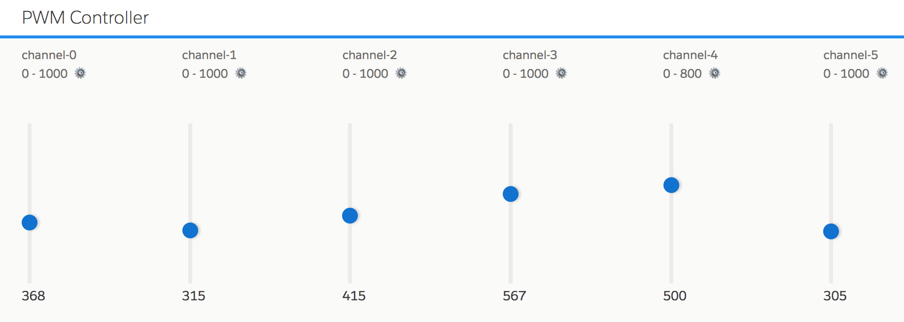

# PWM Controller

Node.js app that lets you control 6 servos connected to a Raspberry Pi PWM Hat. 
The app leverages the following [driver](https://github.com/pozil/adafruit-i2c-pwm-driver) to control the PWM Hat via the i2c protocol.

    

